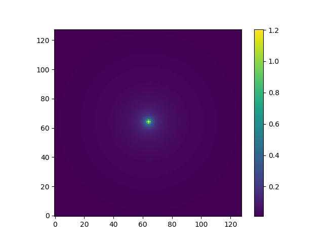

# N body simulation (STILL A BUG IN THIS CODE, WILL FIX ASAP)

The main N body code that can be used for large ranges of particle numbers are the programs:
- Nparticle_periodic.py
- Nparticle_isolated.py

These two programs are for handling the periodic and isolated systems, and are largely similar except for the green's
function calculation and handling of out of bounds particles.

### Dependencies
Novel requirements are c_types, numba packages.

A C library "C_methods.c" is called by the above code using [c_types] in python. The C library must be compiled with the command 

```gcc-9 -o PM_methods.so C_methods.c -O3 --shared```

in the command line. This compiles to a shared library called "PM_methods.so". The particle grid assignment and handling at the boundaries are operations that involve looping over particle positions, and are natively very slow in python. These calculations are instead passed off the the compiled c library for speed augmentation. 

### Simulation Configuration
To run a simulation, open either the Nparticle_periodic.py or Nparticle_isolated.py, and scroll down to the system configuration. Here you can input the number of particles, as well as the grid size and number of iterations and time step of the integration loop.

```
npix = 2**6        # Pixel number
npt  = 300000      # Number of particles
ndim = 3           # Number of dimenesions

# Number of iterations
niter = 10000

# Time step
dt = 0.001
```
The particle masses, and initial conditions can be set in the "particle setup" portion of the code.

### Integrator

This simulator uses the standard leapfrog integration techinque.

### Verbose Mode
Adding the switch -b as a command line argument when calling the above will print all the information associated with a given simulation. 

### Benchmarks
The speed of each component of the alogorithim can be determined by setting
```benchmark = True``` in the python script. You should also set ```niter = 1``` (unless you want to see the output for many iterations of the integrator).

For example, for 100,000 particles @ 128X128X128 grid size, the benchmark mode returns:

```
####### Benchmarks #######
Grid snap calc. time:  0.001196146011352539
FFT calc. time:  0.09336996078491211
Gradient Calc. time:  0.025470256805419922
Integration time:  0.01964592933654785
Grid reset time:  0.0026929378509521484
```
Showing that the FFT is largely the time limiting component of the calculation.

### Potential
The potential map for a single particle (w/isolated BC's) 

Solarized dark             |  Solarized Ocean
:-------------------------:|:-------------------------:
 |  


### Results and Animations

The Animation.py program is written to animate (really just rapidly plot) the outputs of the isolated and periodic Nbody simulation from the above scripts that have been pre-computed and saved in textfile form in the "Positional_data" folder. With the folder contents downloaded (and directory structure intact), you can run

```python Animation.py isolated```
or 
```python Animation.py periodic```

to see an animation of an nbody simulation with 300,000 randomly distributed particles, time step (dt) of 1e-3 and grid size of 64X64X64. For better handling of the figure only every 300 particles of the 300,000 are plotted. The figure is 3 dimensional and fully interactive, allowing the user to rotate figure at will during the animation. 

The Orbit_Animator.py program does a similar job as the above animator, but with extra lines drawn behind the moving particles illustrating their path in space, this is very handy for the visulization of a circular orbit. You can run

```python Orbit_Animation.py simple```
or 
```python Orbit_Animation.py complex```

to animate a pre-computed 2 body circular orbit, or more complex solar system like orbit, respectively. Here the orbiting mass(es) are much lighter than the fixed mass at the center, the grid size is 64X64X64 and the integrator time step is 0.001.
